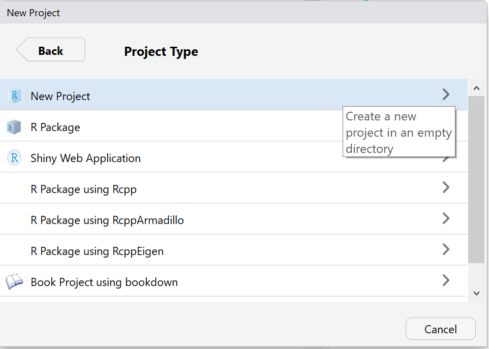

# Psychology R Statistics Workbook 
#### Problems and Solutions in R by Kate Sanders

## Introduction 

Welcome to the wonderful world of R! This will one day be a proper introduction :)

## RStudio Overview

### Installation

To download R Studio, go to the [official website](https://www.rstudio.com/products/rstudio/download/) and click the "DOWNLOAD" button under the free _RStudio Desktop Open Source License_ header. Then download the appropriate installer (not Zip/Tarball). Go through the standard installation instructions. 

### Creating a New Project

Once downloading has finished, open RStudo. We want to create a Project to store all of our code and data from this tutorial. First, to to _File -> New Project_. This will pop a dialog box with three options. Click the first option, _New Directory_. 


Click the first option for Project Type, _New Project_. 


RStudio will then ask you for a Directory Name. This will be the folder that stores all of your project files. Name the Directory "PsycStatsCode". 


### Creating a New R Script

Great job! You should be in the console of your new project directory right now, on the left side of your screen. This is a good place to try out new functions or do simple math. However, if we want to run multiple lines of code at a time or save code for later, we need to create a new R Script (which is just a fancy word for file). Go to _File -> New File -> R Script_. This will give you an untitled script. Now go to _File -> Save As_ and save it as "RStudio_Overview".

### RStudio Windows

RStudio should now be divided into 4 widows:
1. _File View_ (Top Left)
..* You can view Scripts and data files here
2. _Console_ (Bottom Left) 
..* This is the console you were typing in a minute ago. Its a great place to small a line of code before you put it in your Script.
3. _Environment_ (Top Right)
..* Later, we will be creating lots of variables and storing data files. This tab will show you the variables and datasets that you have used. 
4. _Files/Plots/Help_ (Bottom Right)
..* There is a lot going on here. On the _File_ tab, you can see all of the files in your current project directory. You can click on a file to open it in _File View_. We will also use the _Plot_ tab to display plots and the _Help_ tab to see documenation for packages we use.

### Run vs Source

Inside of "RStudio_Overview", type the following lines:
```r
1 + 1
2 + 2
```
Put your cursor on the first line. Press Run at the top right of the window

## R Basics


## Common Error Messages

#### I got an error message. How do I fix it?

##### No Package
If your error message reads 
>Error in library(<span style="color:red">**package**</span>) : there is no package called ‘<span style="color:red">**package**</span>’
then you will want to install the <span style="color:red">**package**</span> causing the problem by typing the following into the R Studio Console:
```r
install.packages(package)
```

## Frequency Distributions

#### Tutorial for Frequency Distributions
Load the following libraries in R Studio. 
```r
library(dplyr)
library(Ecdat)
library(flextable)
library(ggplot2)
```
Refer [here](#no-package) if you get an error when running these lines. 

Throughout this example, we will explore the *Mathlevel* data set. First, we will load the data set into R:
```r
data("Mathlevel")
```
Now, we will pull up more information about the data set:
```r
?Mathlevel
```
Answer the following questions:
1. Where and when were these data recorded?
2. List the variables for student majors and what they stand for.
3. What does the variable "sat" mean? Is it continuous, discrete, categorical, or ordinal?
4. What does the variable "mathlevel" mean? Is it continuous, discrete, categorical, or ordinal?

We can actually see the levels of "mathlevel" in the console:
```r
levels(Mathlevel$mathlevel)
## [1] "170"  "171a" "172a" "171b" "172b" "221a" "221b"
```
Now, let's see how many rows are in *Mathlevel*
```r
nrow(Mathlevel)
## [1] 609
```
Now we are ready to make a frequency table using the variable "mathlevel". This step saves the table as a variable called "mathlevel_frequency"
```r
mathlevel_frequency <- Mathlevel %>% count(mathlevel) 
```
Now choose a method for displaying your table. The first will display the table in the console.
```r
mathlevel_frequency # View the table in the console. "n" is the number of observations
### A tibble: 7 x 2
##  mathlevel     n
##  <ord>     <int>
## 1 170         164
## 2 171a         49
## 3 172a         11
## 4 171b        228
## 5 172b         42
## 6 221a         31
## 7 221b         84
```
The "ord" below "mathlevel" shows that this variable is ordinal. The "int" below "n" shows that this variable is an integer. Note that "n" represents the frequency. 

You can also view this frequency table in a table in a separate window. 
```r
View(mathlevel_frequency) # View the table in a data window
```
There is also an option to display the the table as a nice image in Viewer using the code below.
```r
flextable(mathlevel_frequency) # A pretty table that can be exported as a picture
```
To export the flextable shown in Viewer, click "Export", then "Save as Image..."
(Insert photo!)

Now that we have displayed the frequency table, what is the highest frequency recorded? 

We can also view this data as a barplot.
\\ Insert a sidebar or something so people can learn more about unapparent code. 
```r
ggplot(data = Mathlevel, mapping = aes(x = mathlevel)) + geom_bar() 
```
Now, we will try the same method of making a frequence table for the variable "sat".
```r
sat_frequency <- Mathlevel %>% count(sat)
sat_frequency 
```
Oh no! So many rows! We will need to create a grouped frequency table.

```r
# First, find the maximum and minimum SAT score
min_sat <- min(Mathlevel$sat)
max_sat <- max(Mathlevel$sat)

# Now, lets create variable for the class interval size. We will assign it the value 50
class_interval_size <- 50

# Using this information we can set "breaks" for the intervals
# then cut our continuous data into "class_intervals".
breaks <- seq(min_sat, max_sat + class_interval_size, by = class_interval_size)
sat_frequency <- Mathlevel %>% group_by(sat = cut(Mathlevel$sat, breaks,right = FALSE)) %>% count()
flextable(sat_frequency) # pretty table
```
\\ This is overfilling the box
Let's visualize this as a frequency polygon 
```r
ggplot(data = Mathlevel, mapping = aes(x = sat)) + geom_freqpoly(binwidth = class_interval_size)
```
***
#### Practice Problems for Frequency Distributions

__MSQ Data__ 
The libraries you will need for these questions.
```r
library(dplyr)
library(psych)
library(flextable)
library(ggplot2)
```
Load the "msq" data. Remember, if you are confused, refer to the [example](#example-for-frequency-distributions).

_Problem 1_: 

a) What does MSQ stand for?

b) Write down the scale used in this questionaire.

c) How many rows are in this dataset?

_Problem 2_: 

a) Make a frequency table using the variable "sad"

b) The numeric scale won't mean much to readers. Change the column labels for "sad" from numbers to the labels associated with those numbers using the following command
```r
sad_frequency$sad <- c("Not at all", "A little", "Moderately", "Very Much", "NA")
```

c) How many participants said that they were not at all sad?

d) How many participants didn't answer this question (NA)?

e) Create a barplot showing the reponses for "sad".

_Problem 3_:

a) Make a frequency table using the variable "happy"

b) The numeric scale won't mean much to readers. Change the labels again; see Question 5.b for help. 

c) How many participants said that they were not at all happy?

d) How many participants said that they were at least moderatly happy?

e) Create a barplot showing the reponses for "happy". 

f) Describe the distribution.

_Problem 4_:

a) Find the minimum and maximum of the variable "Neuroticism". Remember to save the values as variables in R!

b) Create variable for the Neuroticism interval size, which should equal 5.

c) Using this information, set "breaks" for the intervals and then cut the continuous data into "class_intervals". Remeber the example is there for reference!

d) View the "Neuroticism" data as a barplot.

e) View the "Neuroticism" data as a histogram. Hint: Replace "geom_freqpoly" in the previous command with "geom_histogram".

[View Solutions](#solutions-for-frequency-distributions)
## Central Tendency 

#### Tutorial for Central Tendency
Load the following libraries in R Studio. 
```r
library(dplyr)
library(Ecdat)
library(flextable)
library(ggplot2)
```
Refer [here](#no-package) if you get an error when running these lines. 

Throughout this example, we will explore the *Mathlevel* data set. First, we will load the data set into R:
```r
data("Mathlevel")
```
Now, we will pull up more information about the data set:
```r
?Mathlevel
```
First, let's get subsets of "sat" scores for students who have and have not taken a language class
```r
language_sat <- Mathlevel$sat[which(Mathlevel$language == "yes")]
no_language_sat <- Mathlevel$sat[which(Mathlevel$language == "no")]
```
Now, we can calculate the mean "sat" score for each group

```r
mean(no_language_sat)
# 623.2468
mean(language_sat)
# 637.1429
```
In order to find the combined mean, we can use a weighted mean based on each group's size and average "sat" score. 
To do that, we will create a vector with the group means and another vector with the group sizes. Then, we can call
the weighted.mean function with the two lists

```r
group_means <- c(mean(language_sat), mean(no_language_sat))
group_lengths <- c(length(language_sat), lenght(no_language_sat))
group_means <- c(mean(language_sat), mean(no_language_sat))
# 624.844
```

We can check the results for our weighted "sat" score mean.
```r
mean(Mathlevel$sat, na.rm = TRUE)
# 624.844
```

Now let's find the median "sat" score.
```r
median(Mathlevel$sat, na.rm = TRUE)
# 630
```

R does not have an inbuilt function for finding the mode. Let's create our own function to find the mode!
First, we can find all of the unique values. In the list (1,2,3,3,4,5,5,5), the unique values are (1,2,3,4,5)
```r
uni <- unique(Mathlevel$sat)
```
This next method finds the how many times each value shows up and picks the largest. Like with in math, read this function from the most nested parentheses outward. We are sending the Mathlevel$sat scores and matching them to the indexes of the unique scores we identified above. Then we are counting how many of each score there is using tabulate(). We use which.max to find the most common score index. We find the score at that index using uni[index].
```r
uni[which.max(tabulate(match(Mathlevel$sat, uni)))]
# 620
```
Rather than calling these two complicated functions every time we want to find a mode, let's make a function. Note that the variable Mathlevel$sat is replaced with x. 
```r
Mode <- function(x) {
  uni <- unique(x)
  uni[which.max(tabulate(match(x, uni)))]
}
```
Let's find the mode SAT score using our new function!
```r
Mode(Mathlevel$sat)
# 620 
```
Looking at the measures of central tendency, how do you think the data will be skewed?
Now that we have the measures of central tendency, let's view the density plot. 

\\ maybe explain density plot
```r
plot(density(Mathlevel$sat), main = "Density of SAT scores")
```

***
#### Practice Problems for Central Tendency

__Treatment Data__ 
The libraries you will need for these questions.
```r
library(dplyr)
library(psych)
library(flextable)
library(ggplot2)
```
Load the "Treatment" data. Remember, if you are confused, refer to the [example](#example-for-frequency-distributions).

_Problem 1_: 

a) What is the mean age of participants?

b) What is the median age of participants?

c) What is the mode age of participants?

d) Calculate the skew of the age of participants.

e) Plot the distribution of the age of participants.


_Problem 1_: 

a) What is the mean age of the real anual earnings of participants in 1974?

b) What is the median age of the real anual earnings of participants in 1974?

c) What is the mode age of the real anual earnings of participants in 1974?

d) Calculate the skew of the real anual earnings of participants in 1974.

e) Plot the distribution of the real anual earnings of participants in 1974.


_Problem 3_: 

a) What is the mean age of the real anual earnings of participants in 1975?

b) What is the median age of the real anual earnings of participants in 1975?

c) What is the mode age of the real anual earnings of participants in 1975?

d) Calculate the skew of the real anual earnings of participants in 1975.

e) Plot the distribution of the real anual earnings of participants in 1975.


_Problem 4_: 

a) What is the mean age of the real anual earnings of participants in 1978?

b) What is the median age of the real anual earnings of participants in 1978?

c) What is the mode age of the real anual earnings of participants in 1978?

d) Calculate the skew of the real anual earnings of participants in 1978.

e) Plot the distribution of the real anual earnings of participants in 1978.

[View Solutions](#solutions-for-central-tendency)

## Variation 

#### Tutorial for Variation

For this example, we will use the Mathlevel dataset again.
```r
library(dplyr)
library(Ecdat)
library(flextable)
library(ggplot2)
data("Mathlevel")
```
First let's get the minimum and maximum SAT scores in this dataset
```r
sat_range <- range(Mathlevel$sat)
```
Now we can find the difference between the minimum and maximum values
```r
diff(sat_range)
```
We would also like to know the IQR of this data, which can be found using a simple function
```r
IQR(Mathlevel$sat)
```
Now let's find the variation:
```r
var(Mathlevel$sat)
```
Before we call the function for variance, let's look at its documentation
```r
?sd
```
Go to the Details section. What denoninator is used in this function?
Now that we know this is the function we want, let's get the standard deveation
```r
sd(Mathlevel$sat)
```

We can also find the mean and standard deviation by group using a pipline of dplyr commands.
```r
# State dataset, group by language, and summarize the sat mean and standard deviation per group
means_language = Mathlevel %>% group_by(language) %>% summarize_at(vars(sat), funs(mean, sd))
means_language # print out result
```
We can also plot these means in a bar graph with error bars using ggplot2.
```r
# declare the grouped mean table created above, plot a bar graph, and add error bars
ggplot(means_language) +
  geom_bar( aes(x=language, y=mean), stat="identity", fill="skyblue", alpha=0.7) +
  geom_errorbar( aes(x=language, ymin=mean-sd, ymax=mean+sd), width=0.4, colour="orange", alpha=0.9, size=1.3)
```


***
#### Practice Problems for Variation

__Treatment Data__ 
The libraries you will need for these questions.
```r
library(dplyr)
library(psych)
library(flextable)
library(ggplot2)
```
Load the "Treatment" data. Each question will state the variable for analysis. Remember, if you don't remember the the name for the variable described, use the help documentation for the dataset. For each variable, find the following values:
a) Minimum and maximum value
b) Range
c) IQR
d) Variance
e) Standard Deviation

_Problem 1_: Participant age

_Problem 2_: Years of education

_Problem 3_: Real annual earnings in 1974

_Problem 4_: Real annual earnings in 1975

_Problem 5_: Real annual earnings in 1978

## Descriptive Statistics

#### Example for Descriptive Statistics
For this example, we will use the Mathlevel dataset again.
```r
library(dplyr)
library(Ecdat)
library(flextable)
library(ggplot2)
data("Mathlevel")
```

Making a boxplot is easy in R; just state the variable, y axis label, and Title (main) for the plot.
```r
boxplot(Mathlevel$sat, ylab = "SAT Score", main = "Student SAT Scores")
```
// Insert image

If we save the boxplot as a variable, we can actually extract several important statistics, like the outliers and quarties.
```r
sat_box <- boxplot(Mathlevel$sat, ylab = "SAT Score", main = "Student SAT Scores")
sat_box$out # Get just outliers
#  [1] 430 460 480 400 460 440 480 440 480 780 780 790 780 780 770
sat_box # get all of the variable's statistics
# $`stats`
#      [,1]
# [1,]  490
# [2,]  590
# [3,]  630
# [4,]  660
# [5,]  750
# attr(,"class")
#          
# "integer"
#
#
# $n
# [1] 609
#
# $conf
#          [,1]
# [1,] 625.5183
# [2,] 634.4817
#
# $out
#  [1] 430 460 480 400 460 440 480 440 480 780 780 790 780 780 770
#
# $group
#  [1] 1 1 1 1 1 1 1 1 1 1 1 1 1 1 1
#
# $names
# [1] ""
```

We can also create side-by side boxplots to show group differences.
```r
boxplot(Mathlevel$sat[which(Mathlevel$language == "yes")], Mathlevel$sat[which(Mathlevel$language == "no")],
        names = c("Language","No Language"), ylab = "SAT Score", main = "Student SAT Scores")
```

To get a better idea of the difference between means, let's find a package to calculate the Effect Size Index, _d_. A quick Google search pulls up several options. We will use _effsize_ here, but feel free to compare the results with a different package!
```r
install.packages("effsize") #install package
library(effsize) # load package
cohen.d(Mathlevel$sat[which(Mathlevel$language == "yes")], Mathlevel$sat[which(Mathlevel$language == "no")])
# Cohen's d
#
# d estimate: 0.2337049 (small)
# 95 percent confidence interval:
#       lower       upper 
# -0.01614697  0.48355676 
```

#### Practice Problems for Descriptive Statistics

__Treatment Data__ 
The libraries you will need for these questions. Be sure to correctly label all plots!
```r
library(effsize)
data("Treatment")
```
_Problem 1_: Create a boxplot of participant education. List the outliers.

_Problem 2_: Create a boxplot of participant age. List the minimum, maximum, and the median.

_Problem 3_: Create a boxplot that shows the real anual earnings of participants in 1974, 1975, and 1978

_Problem 4_: Calculate the following Effect Size indexes

(a) Between earnings in 1974 and 1975
(b) Between earnings in 1974 and 1978
(c) Between earnings in 1975 and 1978

_Problem 5_: Create a boxplot comparing 1978 participant earnings of those who are married and unmarried. 

_Problem 6_: Calculate the Effect Size Index between 1978 participant earnings of those who are married and unmarried.


## Correlation and Regression
#### Tutorial for Correlation and Regression

For this example, we will use the Mathlevel dataset again.
```r
library(carData)
data("Davis")
```
Let's first learn more about this dataset.
```r
?Davis
```

Now, let's do a bit of visualization of the relationship of true and reported weight of participants.
```r
plot(Davis$weight, Davis$repwt, 
     main="True and Reported Weight of 200 Participants", ylab="Reported Weight (kg)", xlab="True Weight (kg)")
```

In the bottom right, you will notice a data point that seems like a clear outlier. This data point was entered incorrectly, and might cause errors in our further analysis. Let's remove it from our analysis. 
```r
Davis <- Davis[which(Davis$weight < 160),] # Since the outlier is the only value with weight over 160 kg
plot(Davis$weight, Davis$repwt, 
     main="True and Reported Weight of 200 Participants", ylab="Reported Weight (kg)", xlab="True Weight (kg)")
```

Now, we can calculate the correlation coefficient, _r_. There are inbuilt methods for determining _r_, but we will use the Pearson method in this analysis. From this, we can simply produce the coefficient of determination _r^2_.
```r
r <- cor(Davis$weight, Davis$repwt,  use="complete.obs", method = "pearson")
r
# [1] 0.9858579
r^2
# [1] 0.9719157
```

This is a very strong coefficient of determination. Now let's create a linear regression model with these variables.
```r
linearModel <- lm(weight ~ repwt, data=Davis)
print(linearModel)
# Coefficients:
# (Intercept)        repwt  
#      2.7338       0.9584  
```

By printing the linear model, you get the intersept value and the slope of the regression line as coefficients. To get more information about the significance of this model, we use the summary() method. The column Pr(>|t|) gives the p-values for the coefficients.
```r
summary(linearModel)
# Call:
# lm(formula = weight ~ repwt, data = Davis)
#
# Residuals:
#     Min      1Q  Median      3Q     Max 
# -7.5296 -1.1010 -0.1322  1.1287  6.3891 
#
# Coefficients:
#             Estimate Std. Error t value Pr(>|t|)    
# (Intercept)  2.73380    0.81479   3.355 0.000967 ***
# repwt        0.95837    0.01214  78.926  < 2e-16 ***
# ---
# Signif. codes:  0 ‘***’ 0.001 ‘**’ 0.01 ‘*’ 0.05 ‘.’ 0.1 ‘ ’ 1
#
# Residual standard error: 2.254 on 180 degrees of freedom
#  (17 observations deleted due to missingness)
# Multiple R-squared:  0.9719,	Adjusted R-squared:  0.9718 
# F-statistic:  6229 on 1 and 180 DF,  p-value: < 2.2e-16
```
To visualize all of this, let's plot the regression line on our existing plot.
```r
plot(Davis$weight, Davis$repwt, 
     main="True and Reported Weight of 200 Participants", ylab="Reported Weight", xlab="True Weight")
abline(linearModel)
```

## Solutions

#### Solutions for Frequency Distributions
[Go back to questions](#practice-problems-for-frequency-distributions)

_Problem 1_

a) Motivtional States Questionnaire

b) 0 = Not at all, 1= A little, 2 = Moderately, 3 = Very Much

c) 3896

_Problem 2_

a)

| sad|    n|
|---:|----:|
|   0| 2825|
|   1|  839|
|   2|  169|
|   3|   53|
|  NA|   10|

b)

c) 2825

d) 10

e)

_Problem 3_

a) 

| happy|    n|
|-----:|----:|
|     0| 1016|
|     1| 1356|
|     2| 1128|
|     3|  380|
|    NA|   16|

b) 
```r
sad_frequency$sad <- c("Not at all", "A little", "Moderately", "Very Much", "NA")
```

c) 1016

d) 1228 + 380 = 1608

e) 

_Question 4_

a)
```r
min_Neuroticism <- min(msq$Neuroticism, na.rm = TRUE)
max_Neuroticism <- max(msq$Neuroticism, na.rm = TRUE)
```

b)
```r
Neuroticism_interval_size <- 5
```

c)
```r
breaks <- seq(min_Neuroticism, max_Neuroticism + Neuroticism_interval_size, by = Neuroticism_interval_size)
Neuroticism_frequency <- msq %>% group_by(Neuroticism = cut(msq$Neuroticism, breaks,right = FALSE)) %>% count()
flextable(Neuroticism_frequency)
```

d)
```r
ggplot(data = msq, mapping = aes(x =Neuroticism )) + geom_freqpoly(binwidth = Neuroticism_interval_size, na.rm = TRUE)
```

e)
```r
ggplot(data = msq, mapping = aes(x =Neuroticism )) + geom_histogram(binwidth = Neuroticism_interval_size, na.rm = TRUE)
```


#### Solutions for Central Tendency
[Go back to questions](#practice-problems-for-central-tendency)


#### Solutions for Descriptive Statistics
[Go back to questions](#practice-problems-for-descriptive-statistics)

_Problem 1_
```r
boxplot(Treatment$educ, ylab="Years of Education", main="Sample Education Levels")
treatment_education_box <- boxplot(Treatment$educ, ylab="Years of Education", main="Sample Education Levels")
treatment_education_box$out3
# [1] 3 3 3 3 3 3 3 3 3 3 3 2 2 3 3 2 2 0 2 2 0 3 3 3 0
```

_Problem 2_:
```r
boxplot(Treatment$age, ylab="Age", main="Sample Ages")
treatment_age_box <- boxplot(Treatment$age, ylab="Age", main="Sample Ages")
treatment_age_box$stats
# Miniumum: 17, Maximum: 55, Median: 32
```

_Problem 3_
```r
boxplot(Treatment$re74, Treatment$re75, Treatment$re78, ylab="Real Anual Earnings", 
        names=c("1974", "1975", "1978"),main="Participant Earnings by Year")
```

_Problem 4_
(a) 
```r
cohen.d(Treatment$re74, Treatment$re75)

# Cohen's d
#
# d estimate: 0.02747125 (negligible)
# 95 percent confidence interval:
#      lower       upper 
# -0.02613556  0.08107806 
```
(a) 
```r
cohen.d(Treatment$re74, Treatment$re78)

# Cohen's d
#
# d estimate:  -0.1544946 (negligible)
# 95 percent confidence interval:
#      lower       upper 
# -0.2081788 -0.1008104  
```

(a) 
```r
cohen.d(Treatment$re75, Treatment$re78)

# Cohen's d
#
# d estimate: -0.179382 (negligible)
# 95 percent confidence interval:
#      lower       upper 
# -0.233094 -0.125670
```

_Problem 5_:
```r
boxplot(Treatment$re78[which(Treatment$married=="TRUE")],Treatment$re78[which(Treatment$married=="FALSE")],
        names= c("Married", "Not Married"), ylab="Real Annual Earnings", 
        main="1978 Earnings of Married vs Unmarried participants")
```

_Problem 6_:
```r
cohen.d(Treatment$re78[which(Treatment$married=="TRUE")],Treatment$re78[which(Treatment$married=="FALSE")])
# Cohen's d
# 
# d estimate: 0.5900193 (medium)
# 95 percent confidence interval:
#     lower     upper 
# 0.4901954 0.6898432 
```
